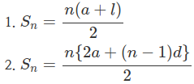

# 2355번 : 시그마

👉 [문제 바로가기](https://www.acmicpc.net/problem/2355)

## 배경 지식
 - `등차수열` : 첫째항부터 차례로 일정한 수를 더하여 만든 수열. 이때 더하는 일정한 수를 공차라고 한다.
 - `등차수열의 합` : 첫째항이 a, 공차가 d, 제 n항이 l인 등차수열의 첫째항부터 제 n항까지의 합을 Sn이라 하면 아래와 같다.

## 푼 방법
등차수열의 합의 공식을 이용해서 풀었다.

조심해야 할 것은, 문제에서 a와 b의 대소 관계에 대한 내용은 언급하지 않았다는 것이다!

## 내 정답 코드 (C++)
~~~c
#include <iostream>
#define SWAP(a, b) {a^=b^=a^=b;}

int main() {
	std::ios::sync_with_stdio(false);
	std::cin.tie(NULL); 
	std::cout.tie(NULL);
	
	long long int a, b;
	
	std::cin >> a >> b;
	
	if (a > b) SWAP(a, b);
	
	std::cout << ((b-a+1) * (a+b)) / 2 << std::endl;

	return 0;
}
~~~